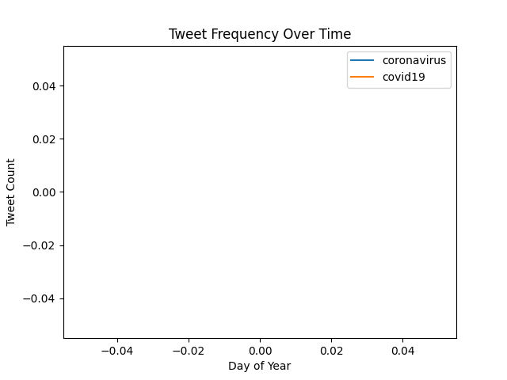

# Twitter Coronavirus Analysis

This project analyzes how coronavirus-related hashtags were used on Twitter across different languages and countries during early 2020. Using a MapReduce-style workflow, I processed large-scale geotagged Twitter data to understand global and linguistic patterns in COVID-19 discussions.

The project focuses on two hashtags:
- #coronavirus
- #코로나바이러스

and visualizes their usage with bar charts and trend plots.

---

## Background

### About the Data
The dataset comes from the Claremont Colleges lambda server and contains geotagged tweets from 2020. In total, the dataset includes over one billion tweets, making it impractical to analyze in a single pass.

### Why MapReduce?
To handle data at this scale, I used the MapReduce divide-and-conquer paradigm, which allows the dataset to be processed in smaller chunks and then combined into final results.

---

## MapReduce Pipeline

### 1. Mapping (`map.py`)
The file `src/map.py` scans each compressed Twitter data file and extracts tweets that contain hashtags. For each matching tweet, it records:
- The tweet’s language
- The tweet’s country of origin (when available)

Each mapper produces two intermediate output files:
- `*.lang` — counts by language
- `*.country` — counts by country

---

### 2. Reducing (`reduce.py`)
The file `src/reduce.py` combines all intermediate `.lang` files into a single language summary and all `.country` files into a single country summary.

The reduced outputs used in this project are:
- `all.lang`
- `all.country`

---

## Visualization (`visualize.py`)

Using `visualize.py`, I generated bar charts showing the top hashtag usage by language and by country. Each graph displays the top 10 categories, sorted from lowest to highest count.

The script was run using:
```
$ python visualize.py --input_path PATH --key HASHTAG
```

### Task 3: Visualize

### By Country

Top 10 countries that used **#coronavirus** in 2020


Top 10 countries that used **#코로나바이러스** in 2020  


### By Language
Top 10 languages that used **#coronavirus** in 2020  


Top 10 languages that used **#코로나바이러스** in 2020  


---

## Task 4: Alternative Reduce (`alternative_reduce.py`)

The plot below shows how hashtag usage changed over the course of 2020.
Each line represents a different hashtag, with the x-axis corresponding
to the day of the year and the y-axis representing the number of tweets.




---

## Summary

This project demonstrates how large-scale social media data can be analyzed efficiently using MapReduce techniques. By combining mapping, reduction, and visualization, I explored how COVID-19 discussions varied across countries and languages during 2020.

The resulting plots provide a clear visual overview of global and linguistic trends in coronavirus-related Twitter activity.
